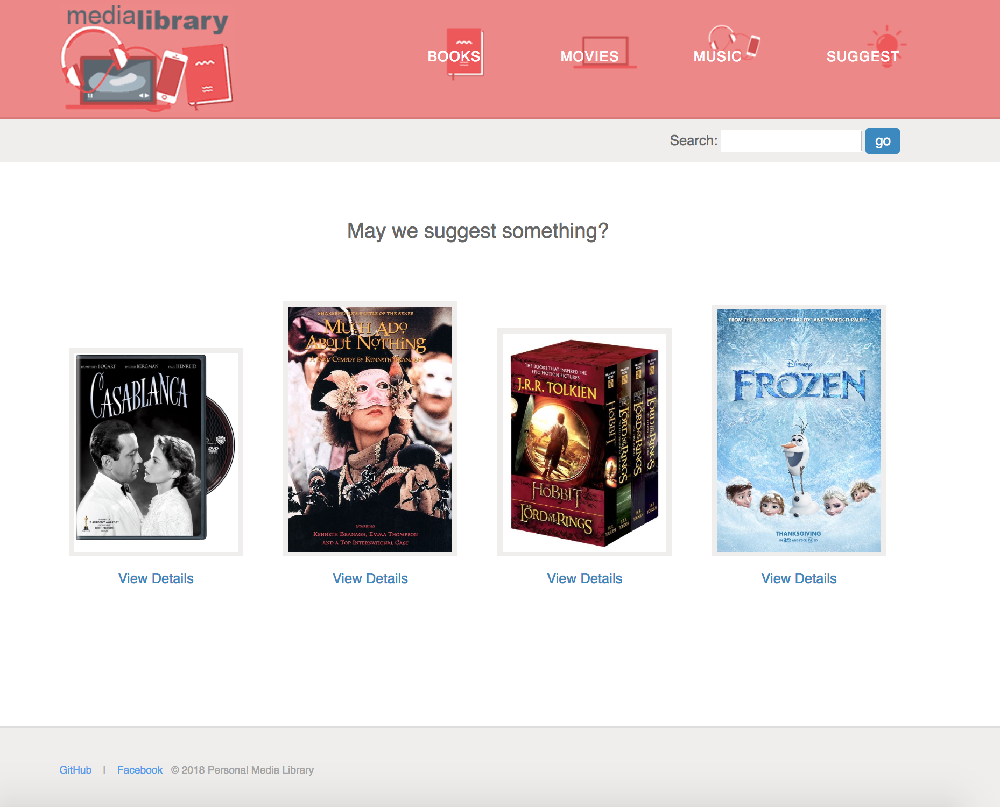
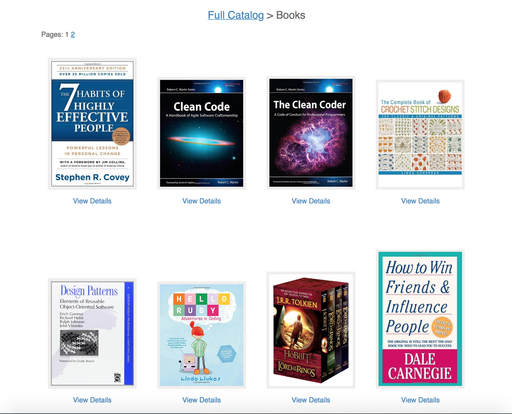
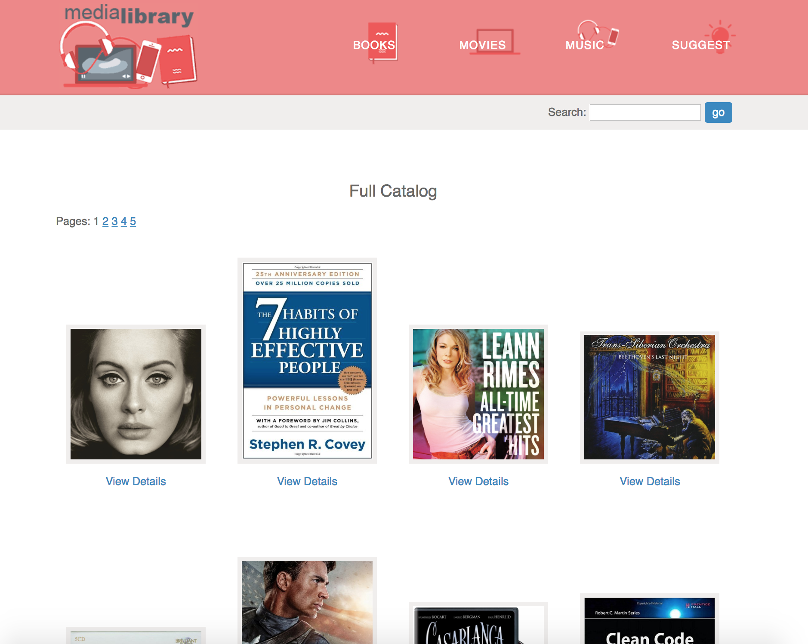
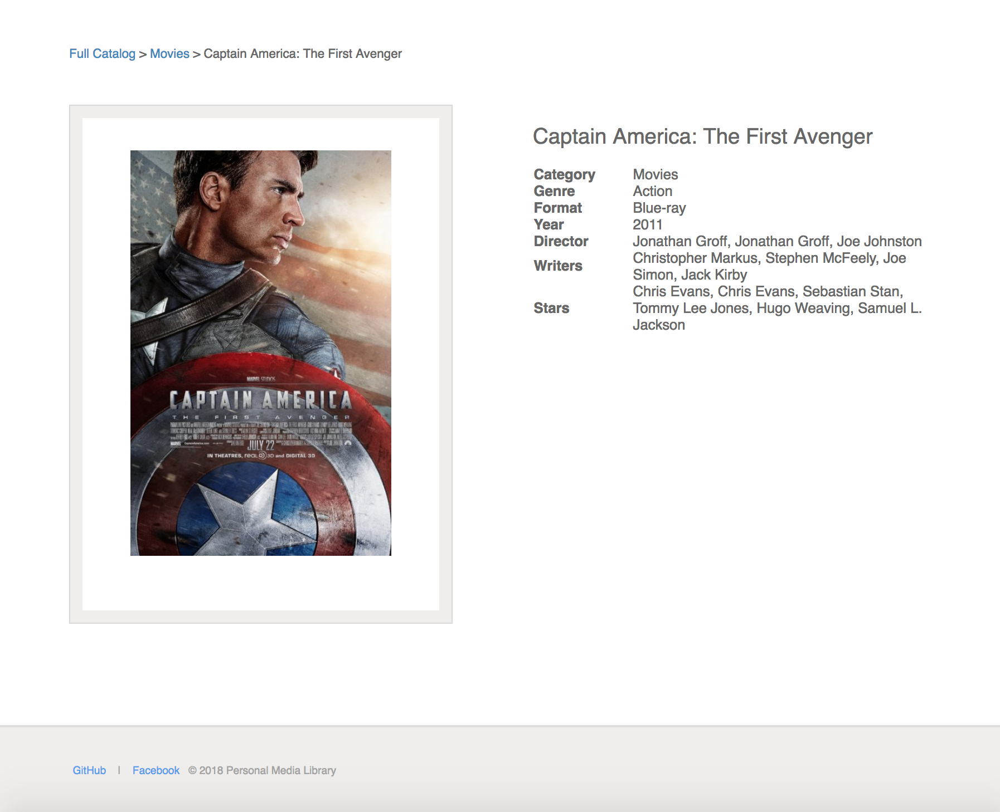
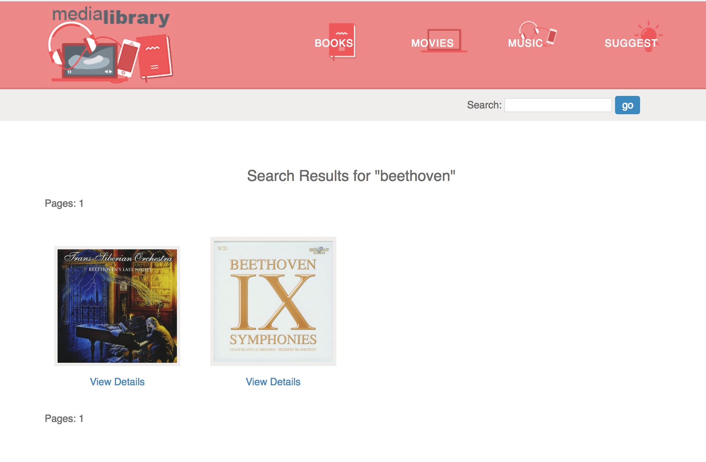
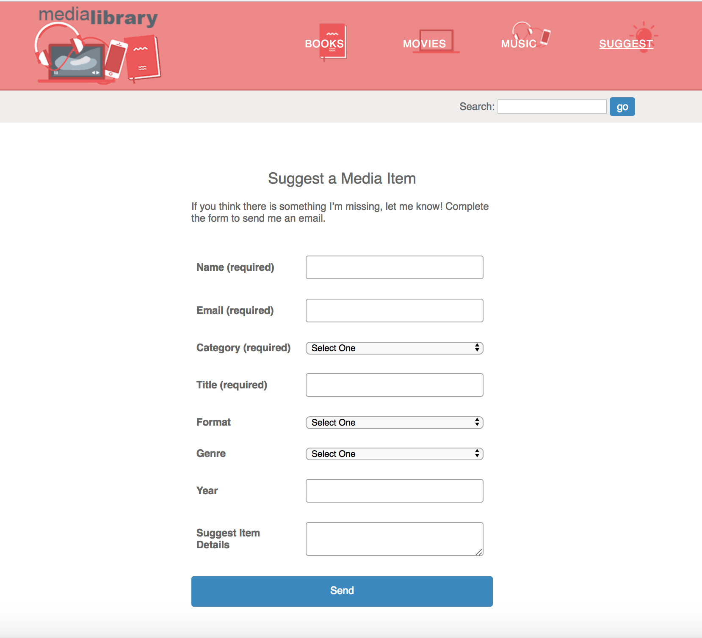

## Dynamic PHP website integrated with databases

This project shows how to build a simple website using the PHP programming language.

The web application, a Personal Media Library, can help to organize and display Books, Movies and Music.

This example can be easily used to create a website that lets you organize and display any type of item: Products, Services, Events, etc.













## Used technologies:

:point_right: Databases

:point_right: Error Handling

:point_right: Pagination

:point_right: Search

:point_right: Breadcrumbs

:point_right: Email (with external library) and Form Data


## Source - [Treehouse](https://teamtreehouse.com/home)

You can find my full Treehouse workflow [here](https://github.com/Navalag/Treehouse-Workflow). Also :exclamation: there is first version of :point_right: [Media Library app](https://github.com/Navalag/Treehouse-Workflow/tree/master/PHP/PHP_website) :point_left: just with less code, without databases but with multidimensional array.

## Launch and Test:

First you need to have local webserver with database mySQL installed.

Clone the project:

```
git clone https://github.com/Navalag/media_library.git
```

In phpMyAdmin create new database "media_library".
Then go to the project folder:

```
cd media_library
```

And in file config/database.php write you database username and password.

**Thats it!** :ok_hand: you can now restart a server and open project in browser.

#### Enjoy :joy:
